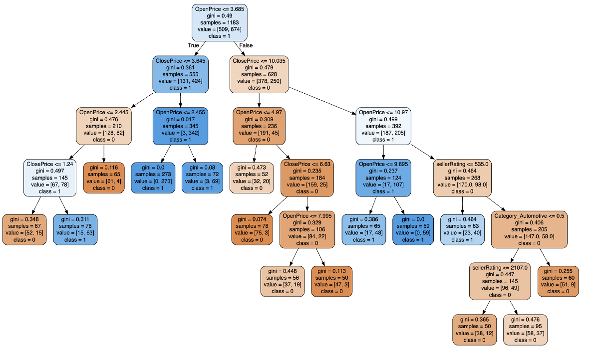
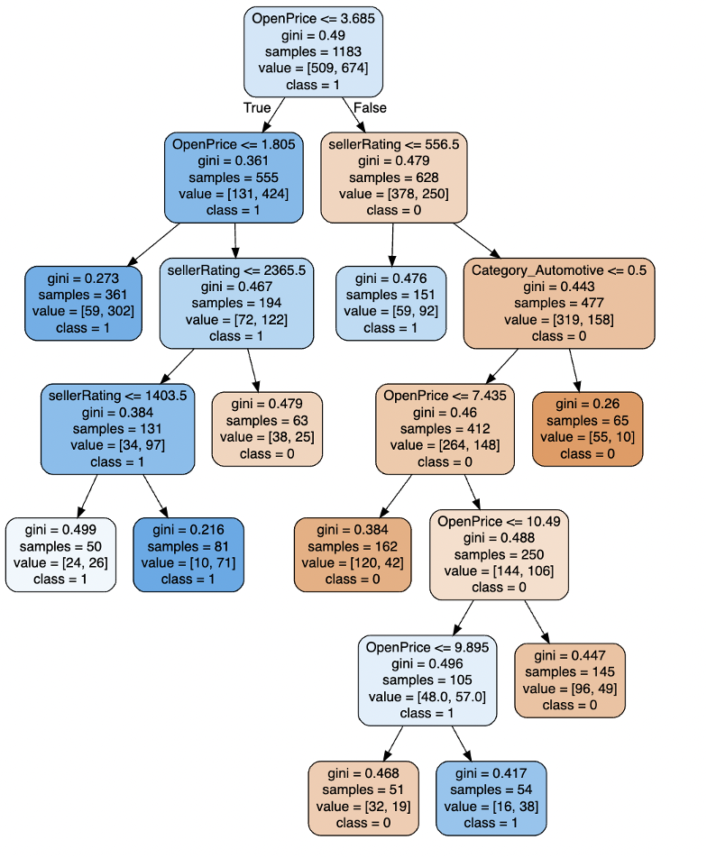
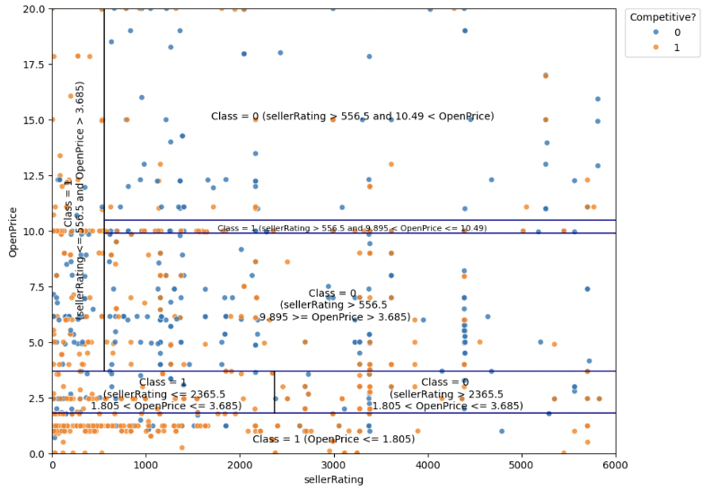

# Key Factors Driving Auction Competitiveness on eBay

One of the primary goals for sellers on e-market platforms like eBay is to attract potential buyers and enhance listing competitiveness. In this project, we utilized **Decision Trees** to identify and visualize key factors influencing auction competitiveness, uncovering insights that drive higher bidding activity and engagement for listed products.

## Step 1: Data Preprocessing

The dataset consists of 1,972 eBay auction records, including factors like item category, seller rating, auction duration, opening and closing prices, and a binary target variable indicating whether an auction was competitive (note: a competitive listing is defined as an auction with at least two bids placed).

To prepare the data, categorical features were converted into dummy variables, and the dataset was split into 60% training and 40% testing.

## Step 2: First Classification Tree

The first classification tree utilizes all predictors with default parameters. While all predictors are included in the model, only **OpenPrice, ClosePrice, sellerRating, and Category_Automotive** were selected as significant factors influencing auction competitiveness.

On the test set, the decision tree achieves a classification accuracy of **83%**. The confusion matrix below provides a detailed breakdown of the model’s performance in distinguishing competitive and non-competitive auctions.

|                  | Predict False | Predict True |
| :--------------: | :-----------: | :----------: |
| **Actual False** |      343      |      54      |
| **Actual True**  |      79       |     313      |

## Step 3: Second Classification Tree

The **ClosePrice** variable was removed from the model as it strongly correlates with auction competitiveness, making it less useful for predictive purposes. Additionally, at the time of predicting whether an auction will be competitive, the final selling price (ClosePrice) is not yet available. 

### 3.1 Hyperparameter Tuning

To optimize the model’s performance, we conducted a grid search with **5-fold cross-validation**, fine-tuning parameters such as **the minimum impurity decrease and minimum sample splits**.

- minimum impurity decrease: 0.004
- minimum sample splits: 5

### 3.2 Plotting Tree on a Scatter Plot

Most of the splits are influenced by two primary quantitative predictors: **SellerRating and OpenPrice**.

- SellerRating: a rating by eBay, based on the number of "good" and "bad" transactions the seller has completed
- OpenPrice: the initial price set by the seller

By plotting these predictors on a scatter plot and visualizing the split lines determined by the model, we can assess the effectiveness of the splits.

- Auctions with lower OpenPrice are generally more competitive, as lower starting prices often attract more bidders. 
- Auctions with lower SellerRating tend to be more competitive, possibly due to buyers being willing to take a chance on less established sellers for better deals. 
- The majority of the splits align with expectations, as lower initial prices typically drive greater competition, and auctions with less reputable sellers may attract more competitive bidding.

To evaluate the effectiveness of the splits, we compared the splitting results to the actual auction data points by calculating the confidence of the rules. 

|                             Rule                             | Confidence |
| :----------------------------------------------------------: | :--------: |
|            IF(OpenPrice <= 1.805), THEN Class = 1            |   81.03%   |
| IF (1.805  < OpenPrice <= 3.685) AND (SellerRating <= 2365.5), THEN Class = 1 |   70.42%   |
| IF (1.805  < OpenPrice <= 3.685) AND (2365.5 < SellerRating), THEN Class = 0 |   63.06%   |
| IF (3.685  < OpenPrice) AND (SellerRating <= 556.5), THEN Class = 1 |   63.09%   |
| IF (3.685 <  OpenPrice <= 9.895) AND (556.5 < SellerRating), THEN Class = 0 |   74.25%   |
| IF (9.895  < OpenPrice <= 10.49) AND (556.5 < SellerRating), THEN Class = 1 |   60.64%   |
| IF (10.49  < OpenPrice) AND (556.5 < SellerRating), THEN Class = 0 |   73.54%   |

- The first rule, with a confidence of 81.03%, shows that auctions with very low starting prices are highly likely to be competitive. 
- Rules with confidence levels over 70% indicate strong predictive reliability, whereas rules with confidence around 60% may require further analysis or refinement.

### 3.3 Predictive Performance

To evaluate the predictive performance of the second classification tree, we applied the model to the test set and compared the predicted values with the actual outcomes. The model achieved an **overall accuracy of 73%**, which is notably lower than the 84% accuracy of the first classification tree.

- **Sensitivity: 77.55%** – The model effectively identifies competitive auctions.
- **Specificity: 68.01%** – The model has more difficulty correctly classifying non-competitive auctions.

## Conclusion

To encourage greater engagement and bidding activity, sellers should consider **setting lower opening prices** to attract initial interest and drive competition. Our analysis shows that auctions with low opening prices tend to be competitive with 81% confidence, making this strategy particularly effective for well-rated sellers who already have buyer trust.

However, **sellers with lower ratings may benefit from setting moderately higher opening prices** to signal value and encourage negotiation, rather than relying solely on price-driven competition.

Additionally, our findings suggest that **listings with high opening prices, even when paired with a strong seller rating, tend to experience lower competition** with 73% confidence—a scenario most sellers may want to avoid. Optimizing both pricing strategy and reputation management can significantly enhance auction success on eBay.
